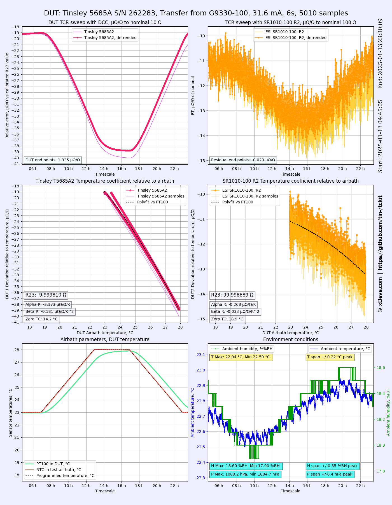

# tckit
Analysis tool for stability / temperature coefficient on CSV-datafiles , based on Python3 matplotlib/numpy. It's designed to help with metrology studies and benchmarking components/instruments.

What it does?
--------------

Idea is to have unified library/script that would be useful to automate testing of various electronic components for temperature, pressure, humidity stability over different conditions. This is achieved with available open-source tools and libraries around Python. This script loads data from CSV/DSV-file with data points from the local filesystem and processed it to generate two copies of the 6-plot image (large size and smaller thumbnail side PNG-images). It also outputs some analytic values in console for debugging/testing. 

This script accepts existing multi-dimensional CSV or DSV files as input data. Typical CSV file columns should include date/timestamp, samples for data to analyse, secondary relative temperature/parameter data stream, ambient sensor parameters (temperature, humidity, pressure, etc). 

Script has ability to detrend linear drift from the data (this can be disabled). Detrending is implemented by looking at first and last 48 samples in data, calculating linear drift rate per sample and then applying opposite sign correction for samples prior to further analysis. This is handy to isolate "long term" steady drift or instrumentation drift from short-term DUT variations that are desired for analytics.

* Initial version of the plotter/analysis is working
* Clean-up code is required to make it more user-friendly
* Make flexible configuration and reduce amount of "magic" constants in code
* More testing required
* Way to unify the processing for various CSV-files
* Need better ways to manage labels/datastreams?

What it does not do?
--------------------

This script is not talking to instruments, does not collect the data samples and does not communicate with another software. For those tasks please check my other [repository TECKit](https://github.com/tin-/teckit) and related [user manual](https://xdevs.com/guide/teckit/). 

Introduction
------------
This repository contains the plotter Python code used for charts, such as one displayed [here](https://xdevs.com/doc/Guildline/9330/xDevs/mi6010rfm_rx_mp1_1000ua_rs_xg9330_100_tcr_3458a_sr1010_r1_jan2025_1.png)

## Software requirements

* Python 3.9 or later
* [NumPy](http://www.numpy.org/) - median/standard deviation analysis
* colorama - for fixing ANSI escape sequences for colors in Windows OS
* matplotlib - for plotting and handling graphics
* csv - for importing CSV/DSV data
* scipy - for fitting and analytics
* pandas - for future processing PD-structured data

## Disclaimer

Code or any information posted here is provided **AS IS**. In no event shall the author or any other 3rd party, including xDevs.com project be liable for any special, direct, indirect, or consequential damages or any damages whatsoever resulting from loss of use, data or profits, whether in an action of contract, negligence or other tortuous action, arising out of or in connection with the use or performance of application, code or any relevant information published here.

While reasonable effort put into making this app useful, there are zero assurances that the software will ever work for any user or use case (even documented ones).
You must agree with the above to have any right to use the software.

Examples
--------

Check rendered examples generated by this analysis tool in [Examples](examples) directory:

* Resistance temperature coefficient for fixed standard

* Voltage temperature coefficient for 7.5-digit digital nanovoltmeter [Hewlett-Packard 34420A](https://xdevs.com/fix/hp34420a_u2/)

Use [*tckit_34420_test4.py*](tckit_34420_test4.py) Python script in examples to generate this plot.

Rendered result:

Usage
-----

TBD
