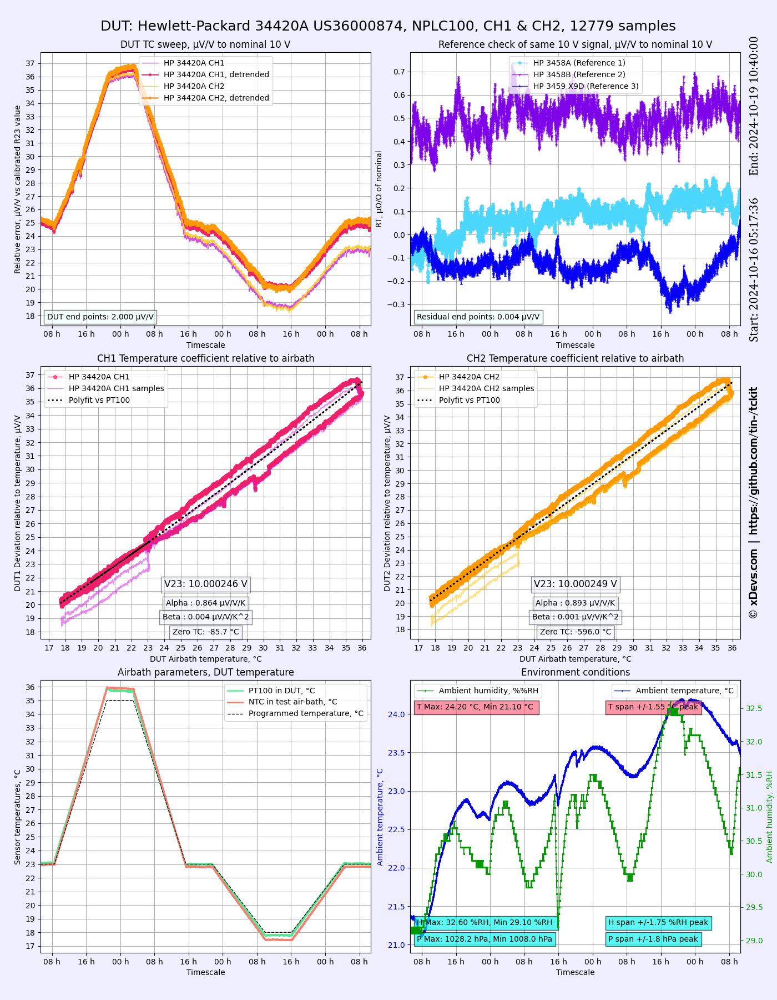

Some examples and plot results showcased here.

File mi6010rfm_rs_t5685_10r_rx_xg9330_100_tcr_3458a_sr1010_r2_jan2025.dsv
---

This data set is showcasing TCR measurement on two devices under test:
* Tinsley 5685A2 resistance standard, measured by Measurements International 6010B DCC bridge
* ESI SR1010-100 R2 element, measured by Keysight 3458A DMM
Both DUTs are located in air-bath and monitored with dedicated PT100 temperature sensor

Useful data is stored in columns:
* Timestamp/datestamp stored in column 1
* Ratio against 100.003368 Ω standard stored in column 5
* ESI SR1010-100 absolute value stored in column 11
* Ambient temperature sensor data stored in column 26
* Ambient humidity sensor data stored in column 27
* Ambient pressure sensor data stored in column 28
* PT100 DUT temperature sensor stored in column 30
* NTC for air-bath rear sensor stored in column 29
* Setpoint for air-bath stored in column 32

Rendered result:

File hp3458abx_hp34420a_tcsweep_10vdc_nplc100_test1_oct2024_1.dsv
---

This data set is showcasing TC measurement on HP 34420A nanovoltmeter 10V range with both channels under test:
34420A was located in air-bath and monitored with dedicated PT100 temperature sensor nearby.

Useful data is stored in columns:

* Timestamp/datestamp stored in column 1
* HP 34420A DUT for Channel 1 data stored in column 13
* HP 34420A DUT for Channel 2 data stored in column 14
* HP 3458A 1 reference 10 V data stored in column 10 (offset +1 ppm applied)
* HP 3458A 2 reference 10 V data stored in column 11
* HP 3459A 3 reference 10 V data stored in column 12 (offset -2.6 ppm applied)
* Ambient temperature sensor data stored in column 26
* Ambient humidity sensor data stored in column 27
* Ambient pressure sensor data stored in column 28
* TMP119 DUT temperature sensor stored in column 8
* Additional TMP117 DUT temperature sensor stored in column 7
* NTC for air-bath rear sensor stored in column 29
* Setpoint for air-bath stored in column 32

Use [*tckit_34420_test1.py*](tckit_34420_test1.py) Python script to run this example.

Rendered result:

